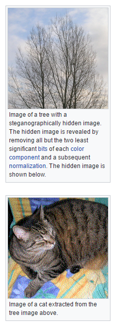
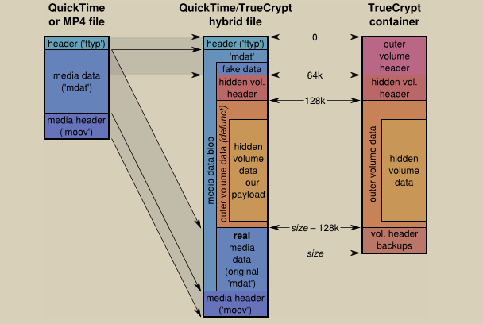

- title : Passwords strategies for the semi-paranoid
- description : Passwords strategies for the semi-paranoid
- author : Koen Metsu
- theme : black
- transition : default

***

# Passwords strategies for the semi-paranoid

***

## The only good passwords are those you can't remember

***

## Password managers to the rescue!

***

## Online password managers

#### Storing your passwords with a 3rd party provider

---

## Convenient for you

- One place
- Good integration
- Backups
- 2FA
- Local encryption/decryption

---

## They're in business for this sole purpose

---

#### Convenient for hackers
- Client-side malware
- Court orders
- Large target for hacks
- Insiders

---

# If it's on the web, *somebody* has access to it.

---

## Conclusion

### Pretty safe, but for the paranoid...????

***

## Offline

#### Storing your password database yourself

---

## Good for the paranoid

#### At the small expense of less convenience...

- Safe for paranoid levels 1 - 3000
- Customizable
- Open source

---

## What in case of loss?

- Back up onsite
- Back up offsite

---

## How to access on the go?

- Usb thumb drive
- 3rd party cloud sync

---

# If it's on the web, *somebody* has access to it.

***

## What in case of 3rd party access?

---

## Multi-factor authentication

#### Make your master password more than a password

- Something you **know**
- Something you **have**
- Something you **are**

---
## Yubikey

#### Something you have

- Static password
- TOTP
- Challenge/Response
- NFC

---

## Yubikey

####Simplest approach:

[password you know]  +  [long meaningless static password from yubikey]

 **Pro tip**: keep copies of your Yubikey

---

## Key Files

#### Something you have

- Regular file(s)
- Content must be kept secret
- Must provide key file to open password database

***

## Veracrypt
#### Hide your password file

- Create encrypted file, store kdbx file in that
- Use multi-factor authentication
- Hide with steganography

---

## Steganography

---

## Steganography

***

# Be paranoid, it's fun!

---

# Determine your attack vectors

---

# Don't forget

[source](https://imgs.xkcd.com/comics/security.png)

***

# Thank you
### Follow me [@koenmetsu](https://twitter.com/koenmetsu "@koenmetsu")
