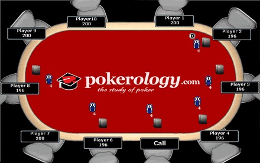

- title : Splitting up a problem into microservices
- description : Hands on session: splitting up a problem into microservices
- author : Koen Metsu
- theme : moon
- transition : default

***

# Splitting up a problem into microservices

### Erik Talboom & Koen Metsu

***

# Erik Talboom

## Co-learning

* Agile transformation and facilitation expert

***

# Koen Metsu

## Independent Consultant

* .NET, C#, F#, Javascript, Java, Ruby

***

# SoCraTes BE

* Community for Belgian Software Craftsmanship and Testing
* Learn from each other
* Share knowledge and experiences
* Practice together

***

# Poker

***

# Have fun!

***

# Global Day of Coderetreat 2015

### November 14, 2015
#### A day to celebrate passion and software craftsmanship

#### http://globalday.coderetreat.org/
#### http://meetup.com/Belgian-Community-for-Software-Craftsmanship/events/225605456/

***

# Thank you!