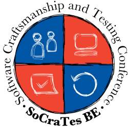

- title : SoCraTes BE
- description : Introduction to SoCraTes BE
- author : Koen Metsu
- theme : beige
- transition : default

***

## SoCraTes BE 2015

***

### What is SoCraTes?

#### Software Craftsmanship and Testing
* It's about **People**
* It's about **Action**
* It's about **Fun**

***

### People

* Run by YOU
* People passionate about Software Craftsmanship
* Share your knowledge
* Learn from others

---

### Action

#### Self-organized Open Space

* Hands-on coding sessions
* Sessions focused on discussions
* Interactive talks
* Pairing

---

### Fun

#### Chill out with fellow developers
* Hiking
* Board games
* Beer
* Talking

***

### When?
#### October 22 - 25 2015

---

### Where?
#### [Floreal holiday park, Nieuwpoort](http://www.florealgroup.be/en/page/nieuwpoort-en.html)

* Easily accessible by public transportation or car
* Walking distance (500m) from beach
* Northern Europe's largest marina

---

### What's included?

* Lodging
* Breakfast, lunch and dinner
* Tea, coffee, water and biscuits throughout the day

---

### What's included?

* Parking
* Wifi
* Free access to
    * Swimming pool
    * Outdoor sports fields
    * 18-holes mini golf course

***

### Pricing

* Single room: €299.60
* Single bed in a twin room: €254.60

---

### Join us
## [www.socratesbe.org](http://www.socratesbe.org "www.socratesbe.org")

Twitter
## [@SoCraTes_BE](https://twitter.com/socrates_be "@SoCraTes_BE")
