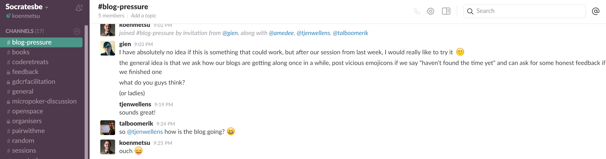
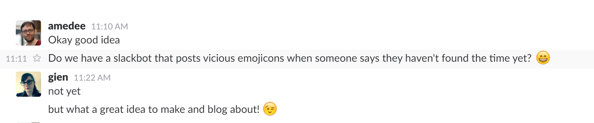
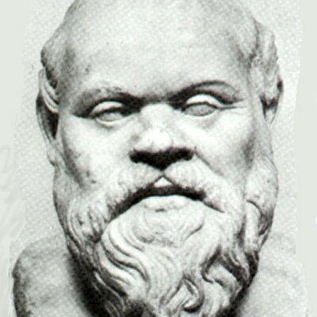

- title : Socrates, slack bot
- description : SoCraTes Slack Bot Pet Project
- author : Koen Metsu
- theme : black
- transition : default

***

# SoCraTes Slack Bot Pet Project

***
## Why?

### Software Craftsmanship and Testing
* It's about **People**
* It's about **Action**
* It's about **Fun**

---

### Why??

---

### Why???

***

## Enter Socrates

---

### Socrates' Principles

* Opt-in
* "Remind me to blog" + time
* Glory or Shame

---
### DING, DING

***

## Technically

---

### Node.js

BotKit, Chrono and some json

---

### Run on local server

***

## Things I'd like to improve

---

### Testability
Help?

---

### Hosting

* Cheap cloud (Lambda, Azure, ...)

Help?

---

### Continuous Deployment

*(To said cheap cloud)*

Help?

---
# Thank you
### Follow [@koenmetsu](https://twitter.com/koenmetsu "@koenmetsu")
